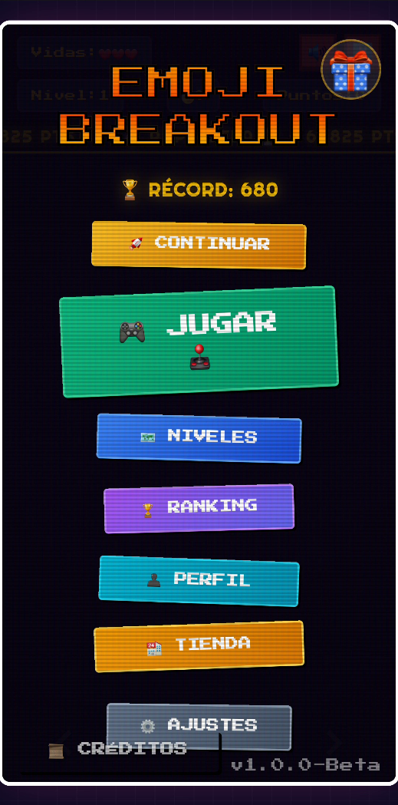
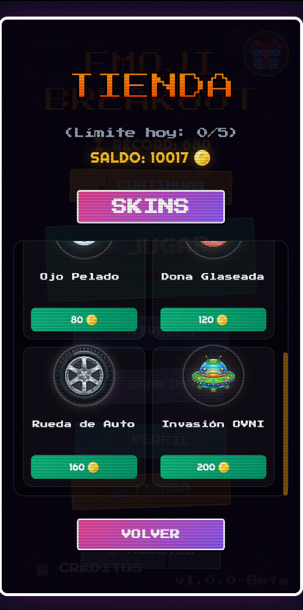
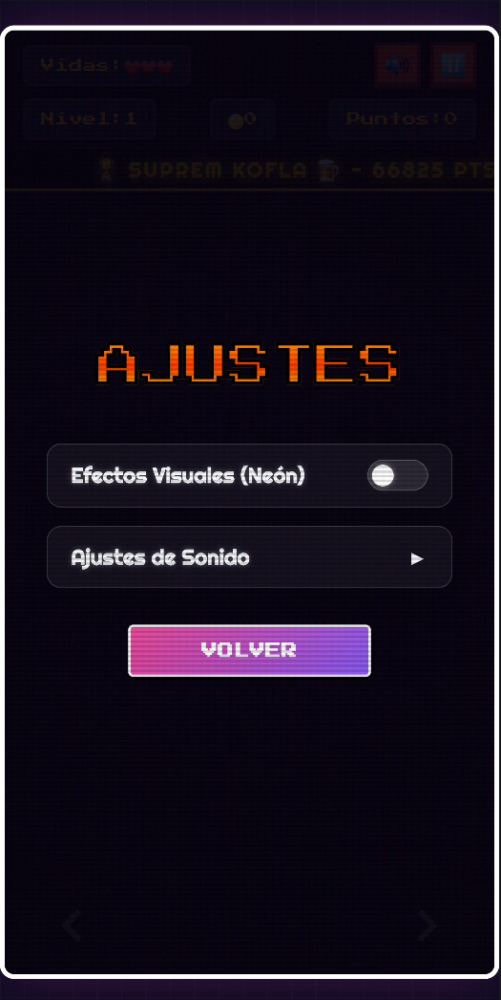
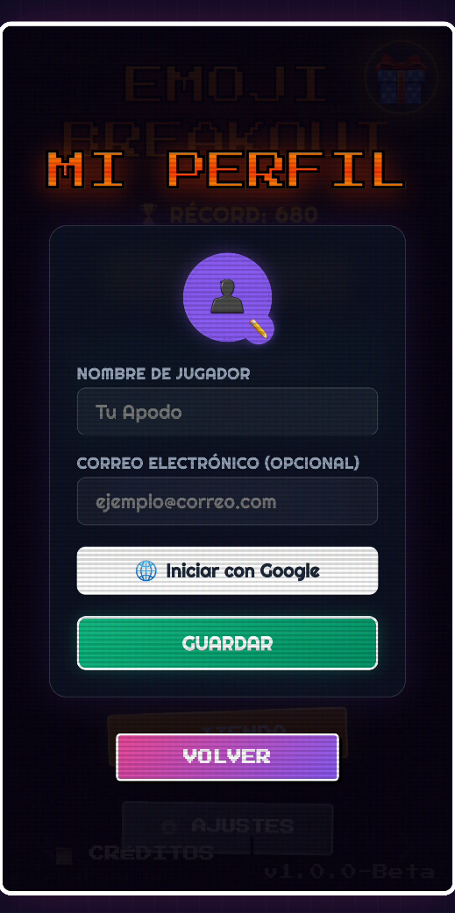
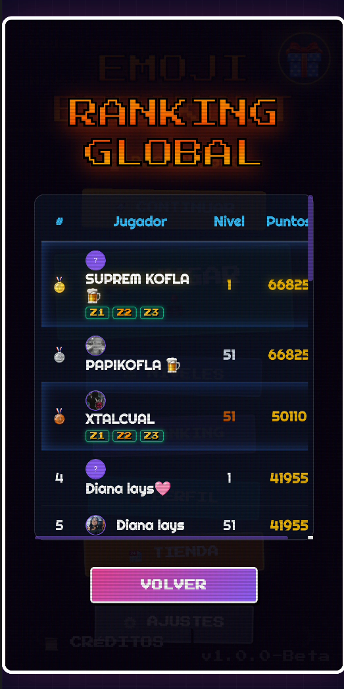
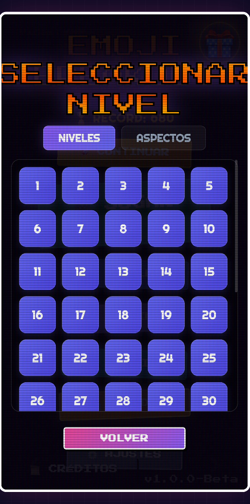
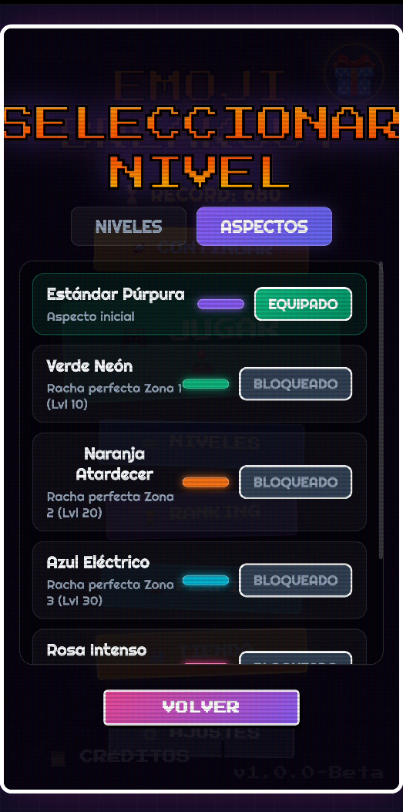
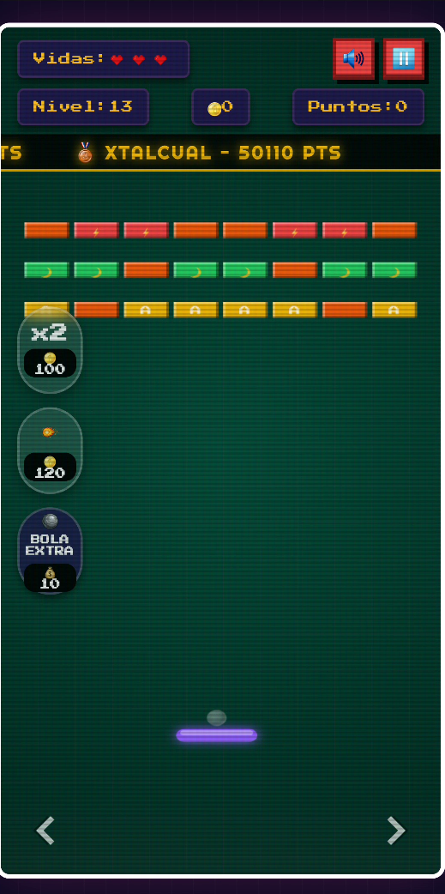

# 🎮 Emoji Breakout

¡Bienvenido a **Emoji Breakout**! Este es un emocionante juego de estilo Breakout (rompe-ladrillos) diseñado para dispositivos Android, que combina la flexibilidad del desarrollo web (HTML5 Canvas + CSS3 + JavaScript) con la potencia de Kotlin nativo.

El juego cuenta con un total de **50 niveles** de dificultad progresiva, mecánicas interactivas de bloques móviles, físicas fluidas con deformación elástica de la bola, efectos visuales de neón y partículas, un sistema de logros, tienda, y ranking global en tiempo real.

---

## 📸 Capturas de Pantalla

  
  
  
  
  
  
  
  

---

## 🚀 Características Principales

### 🕹️ Jugabilidad Avanzada
* **50 Niveles Progresivos**: La velocidad de la bola y la complejidad del diseño de los bloques aumentan en cada nivel.
* **Bloques Especiales**:
  * 🪨 **Ladrillo Indestructible** (`Infinity` de vida): Bloques de roca que no se pueden romper.
  * 💎 **Ladrillo de Diamante** (3 golpes): Cambia de aspecto y se agrieta progresivamente con el daño.
  * 🧱 **Ladrillo Común** (2 golpes): Ladrillo resistente que requiere dos impactos.
  * 🍓🍊🍋🍏 **Ladrillos Simples** (1 golpe): Ladrillos de colores con frutas u objetos.
* **Bloques Móviles**: A partir del nivel 20, un porcentaje de los bloques se desplaza lateralmente para añadir dificultad.
* **Efectos de Partículas y Estética Neón**: Animaciones de partículas al destruir bloques, explosiones vibrantes y una interfaz pulida de estilo arcade moderno competitivo.

### ⚡ Power-ups y Debuffs (Efectos Especiales)
Al romper ciertos bloques, caerán ítems con efectos temporales que alteran el juego:
* ❤️ **Vida Extra (`life`)**: Añade un corazón a tus vidas disponibles.
* 📏 **Paleta Larga (`long`)**: Incrementa el tamaño de la barra en un 60% por 10 segundos.
* 🤏 **Paleta Corta (`short`)**: *Debuff* que reduce el tamaño de la barra en un 40% por 10 segundos.
* 🔥 **Bola de Fuego (`fireball`)**: La bola adquiere el emoji de fuego y atraviesa todos los bloques destruyéndolos de un solo golpe durante 10 segundos.
* 🔮 **Multi-bola (`multiball`)**: Duplica tu bola actual creando dos copias más en juego.
* 💀 **Velocidad Extrema (`fast`)**: *Debuff* que acelera la bola un 1.7x durante 6 segundos.
* 🌀 **Controles Invertidos (`inverted`)**: *Debuff* que invierte el movimiento de la barra (y la tiñe de color rojo) por 8 segundos.

### 🛒 Tienda y Logros
* **Sistema de Monedas**: Recolecta monedas durante el juego para usarlas en la tienda.
* **Tienda de Mejoras**: Compra power-ups para usar en cualquier momento (ej. Iniciar con Bola de Fuego, Bola Extra).
* **Rachas Perfectas (Logros)**: Logros especiales por superar zonas de 10 niveles sin perder vidas (Z1, Z2, Z3, Z4, Z5). Los jugadores con logros mostrarán insignias compactas en el Ranking Global.

### 🏆 Ranking Global y Perfiles
* **Autenticación**: Integración de inicio de sesión y selección de foto de perfil.
* **Clasificación Mundial**: Tabla de clasificación (Leaderboard) global en tiempo real utilizando Firebase Realtime Database. Compara tu puntuación, nivel máximo y logros con jugadores de todo el mundo.

### 📱 Integración Nativa Android (Kotlin ⇄ JavaScript)
El juego se renderiza en un `WebView` de alto rendimiento y se comunica con el sistema nativo a través de una interfaz de puente (`AndroidInterface`):
* **Sistema de Audio Nativo**: Controlado en Kotlin por un `SoundManager` nativo usando `SoundPool` para baja latencia (SFX de rebotes, golpes, pérdidas de vida y power-ups) y `MediaPlayer` para música de fondo en bucle.
* **Control de Música inteligente**: Pausa automáticamente la música de fondo si la aplicación pasa a segundo plano (`onPause`) y la reanuda al volver al primer plano (`onResume`).
* **Sincronización en la Nube**: Conexión a Firebase para el guardado de récords en el Ranking y persistencia local de progreso, puntaje, monedas y compras en la tienda.

---

## 🛠️ Arquitectura y Estructura del Proyecto

El repositorio está organizado de la siguiente manera:

* **`/app/src/main/assets/`** - Contiene los recursos frontend del juego:
  * `index.html` - Interfaz principal del juego, overlay de menús, tienda y perfiles.
  * `style.css` - Estilos modernos con paleta de colores vibrantes, estética neón y soporte responsivo.
  * `game.js` - Núcleo del motor de físicas, animaciones en Canvas, sistema de partículas, gestión de Firebase RTDB y bucle del juego (`GameLoop`).
* **`/app/src/main/java/com/ktoledo/emoji_breakout/`** - Código fuente Kotlin nativo de Android:
  * `MainActivity.kt` - Punto de entrada principal que carga el `WebView` y conecta la app al ciclo de vida del sistema.
  * `GameInterface.kt` - El puente `@JavascriptInterface` que permite a JavaScript ejecutar funciones del dispositivo móvil.
  * `SoundManager.kt` - Administrador de sonidos y audio en segundo plano usando APIs nativas.

---

## 📈 Mejoras Completadas Recientemente
* [x] Conectar la base de datos de Firebase RTDB para el ranking global en tiempo real.
* [x] Implementar tienda, ítems virtuales y monedas.
* [x] Sistema de insignias en ranking para logros de racha perfecta por zonas (Z1 a Z5).

## 🔮 Futuras Mejoras
* [ ] Agregar más niveles interactivos y bloques con físicas de gravedad.
* [ ] Implementar un editor de niveles personalizado desde la interfaz web.
